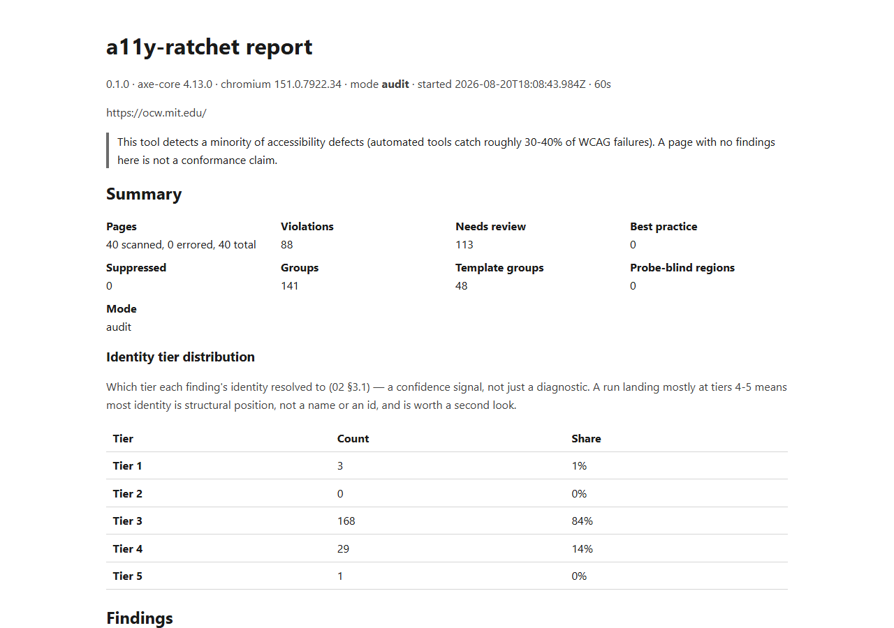

# a11y-ratchet

[](https://github.com/indra-nakka/a11y-ratchet/actions/workflows/ci.yml)

> **Status: pre-release, Day 14 of a 15-day build.** Feature-frozen since Day 13. Scan,
> diff, baseline lifecycle, the HTML/JSON/terminal reports, `manual`, and the GitHub Action
> are functional and tested; no stubs remain in `src/`. The section marked `TODO(Day 14–15)`
> contains no data yet and must not be filled in with estimates. See
> [`docs/00-BRIEF-AND-PLAN.md`](docs/00-BRIEF-AND-PLAN.md) for the plan.

Crawls a site, runs [axe-core](https://github.com/dequelabs/axe-core) and keyboard-interaction
probes on every page, maps each finding to its WCAG 2.2 success criterion, and diffs two runs
so CI can fail a PR on new violations. A ratchet turns one way: violations may be fixed,
never added.

It detects a **minority** of accessibility defects. See [Coverage](#coverage) for exactly
which ones and [What this cannot catch](#what-this-cannot-catch) for the rest.

---

## Quickstart

Not yet published to npm, so `npx a11y-ratchet` doesn't resolve — clone and link
instead. Verified end to end against a fresh clone of this repo:

```bash
git clone https://github.com/indra-nakka/a11y-ratchet
cd a11y-ratchet
npm install
npm run build
npm link            # exposes the `a11y-ratchet` command globally

cd /path/to/somewhere-else
a11y-ratchet scan https://example.com --max-depth 2 --out .a11y/baseline.json
a11y-ratchet scan https://example.com --max-depth 2 --out head.json
a11y-ratchet diff .a11y/baseline.json head.json --html report.html
```



<!-- TODO: CI job-summary screenshot. Attempted against the real demo-PR run
(https://github.com/indra-nakka/a11y-ratchet/actions/runs/32399787931) and found the run
page renders no step/job summary content at all for a logged-out viewer — same "Sign in to
view logs" gate that hides raw logs appears to hide the custom Markdown summary too, even
though the run log confirms the "Write job summary" step executed and wrote real content
to $GITHUB_STEP_SUMMARY. Needs a screenshot taken while actually signed in. See
`brain/BUGS.md` B6. -->

## Coverage

<!-- GENERATED:coverage — regenerate with `npm run docs:coverage`. Do not hand-edit. -->

WCAG 2.2 has 86 success criteria; an AA conformance claim covers the 55 at Level A and AA.[^1]

| | Criteria | |
|---|---:|---|
| Detectable | 4 | 1.4.3 · 2.4.2 · 3.1.1 · 4.1.2 |
| Probe (this tool, not axe) | 2 | 2.1.2 · 2.4.11 |
| Partial | 17 | narrow subclass caught; most real failures invisible |
| Manual only | 32 | no meaningful automated signal |
| **Any automated signal** | **23** | **42% of A/AA** |
| **Certifiable** | **0** | — |

<!-- /GENERATED:coverage -->

<!-- GENERATED:coverage-sentence -->
This tool produces evidence for 23 of the 55 A/AA criteria and can certify none of them.
2 of those 23 come from interaction probes a static DOM scanner cannot perform. The
remaining 32 require a human — `a11y-ratchet manual` will generate you a checklist.
<!-- /GENERATED:coverage-sentence -->

Full matrix: [`docs/03-EVIDENCE.md`](docs/03-EVIDENCE.md#part-1--wcag-22-coverage-matrix).

[^1]: 86, not 87. WCAG 2.1 had 78; 2.2 adds 9 and removes 4.1.1 Parsing as obsolete.
Checklists reporting 87 are double-counting a criterion that no longer exists.

## What this cannot catch

Automated tools catch roughly 30–40% of WCAG failures ([WebAIM](https://webaim.org/projects/million/),
[Deque](https://www.deque.com/)). Everything else needs a person with a keyboard and a
screen reader. Concretely — all of these pass every automated check and fail WCAG:

| Defect | Passes | Fails |
|---|---|---|
| `alt="DSC_0421.jpg"` | `image-alt` | 1.1.1 Non-text Content |
| A "Read more" link | `link-name` | 2.4.4 Link Purpose |
| Required fields marked only in red | everything | 1.4.1 Use of Color |
| Visually reordered flex layout | everything | 1.3.2 Meaningful Sequence |
| `aria-live` on a region that never updates | everything | 4.1.3 Status Messages |

**The state problem.** This tool sees each page as it first renders. Modals, dropdowns,
validation errors, loading states, and toasts are never scanned — and in most applications
that is where the serious defects live. Scanning them requires driving the application,
which produces a non-deterministic page set — and a diff over a non-deterministic page set
reports regressions that are only a different traversal.

**Other boundaries.** Chromium only. No screen reader is involved at any point. Closed
shadow roots are unreachable and are reported as `probe-blind` rather than as zero findings.

**What a passing run means.** No *detected* violations. Not conformance, not a VPAT, not a
legal defence.

## Real-world results

> `TODO(Day 14–15)` — two sites, run in `--mode=audit`, every distinct finding verified by
> hand. Report pages crawled, distinct findings, true positives, false positives, arguable,
> with the mechanism behind each false positive named. **Do not populate from a run that
> wasn't manually verified.**

## Diff mode

The hard part of a regression gate isn't finding violations — it's deciding that *this*
violation is the same one as last time. Selector-based identity reports sixty regressions
the first time someone adds a wrapper `<div>`, the team disables the gate, and the tool is
dead. `a11y-ratchet` fingerprints findings from tiered element identity — authored ID, test
hook, accessible name, semantic path, structural path — deliberately excluding the raw CSS
selector.

| Class | Gates CI | |
|---|---|---|
| `new` | yes (axe violations only) | absent from baseline |
| `impact-changed` ↑ | yes | same element, higher severity |
| `moved` | no | same defect, relocated |
| `impact-changed` ↓ | no | improvement |
| `persisting` / `fixed` | no | |
| `unknown-page-*` | per `newPagePolicy` | see below |

**Page-set changes are handled separately.** If a page 404s between runs, its findings are
`unknown-page-removed`, never `fixed` — otherwise the report celebrates a regression.

**Runs must be comparable.** Diffing across `axe-core` versions, scan modes, or render
config (viewport, colour scheme, locale) produces phantom regressions, so it is refused by
default. Bump `axe-core` and regenerate the baseline in the same PR rather than forcing
`--allow-engine-drift` permanently.

Design detail: [`docs/02-IDENTITY-AND-DIFF.md`](docs/02-IDENTITY-AND-DIFF.md).

## Scan modes

| | `--mode=ci` (default) | `--mode=audit` |
|---|---|---|
| Third-party requests | blocked | allowed |
| For | diffable, low-variance gating | an honest picture of the real page |

Cookie banners and chat widgets are third-party *and* the most common cause of obscured
focus, so CI mode will under-report 2.4.11. Every report records its mode; cross-mode diffs
are refused.

## Baseline workflow

The baseline is a committed file (`.a11y/baseline.json`), not a CI artifact — artifacts
expire and can't be reviewed in a PR. **CI never writes to your repository**; it fails the
gate and prints the command to run locally.

| Situation | Command |
|---|---|
| A fix merged; violations disappear | `a11y-ratchet baseline update`, committed with the fix |
| `axe-core` bumped | `a11y-ratchet baseline regenerate` in the same PR, so reviewers see the churn |
| Baseline drifts from `main` (the live site changed, nobody scanned it) | `a11y-ratchet baseline check`, run on a schedule — open an issue on drift |
| A violation deliberately accepted | *Not a baseline change* — a suppression, with a reason, an owner and an expiry |

All four run locally or on a schedule, never as part of the PR gate — the Action never
writes to your repository. Baselines record reality; config records decisions. Keeping them
separate is the point.

## Configuration

Suppressions require a justification, an owner, and an expiry. `a11y-ratchet check-config` exits
non-zero on expired entries, so a suppression is a dated decision rather than a mute button.

```javascript
// a11y-ratchet.config.js
/** @type {import('a11y-ratchet').Config} */
export default {
  mode: 'ci',
  suppressions: [{
    id: 'stripe-iframe-contrast',
    rule: 'color-contrast',
    urlPattern: '/checkout*',
    // false-positive | accepted-risk | third-party | deferred
    category: 'third-party',
    reason: 'Inside Stripe Elements iframe; not ours to fix. Raised as Stripe #12345.',
    owner: '@you',
    expires: '2026-12-01',
  }],
};
```

Suppressed findings stay in the report, tagged — never dropped.

## GitHub Action

A composite action wrapping the CLI ([`action.yml`](action.yml)) — not a bundled TS action,
so what it runs is exactly what you'd type yourself. It caches the Playwright browser
download (the slowest step by an order of magnitude) and never writes to your repository:
a missing or stale baseline fails the job and prints the exact command to run locally.

```yaml
- uses: actions/checkout@v4
- uses: indra-nakka/a11y-ratchet@main
  with:
    url: https://staging.example.com
    baseline: .a11y/baseline.json   # default
    max-depth: 2                    # default
    mode: ci                        # default; audit allows third-party requests
    # config: a11y-ratchet.config.js
    # allow-engine-drift: true      # only while a baseline-regenerating PR is in flight
```

Two real pull requests against this repo's own [demo workflow](.github/workflows/a11y-demo.yml)
and [demo site](examples/demo-site/index.html), each linking its own job summary — a CI
feature nobody can see running is a claim; a linked PR is evidence:

- [**#1 — fails the gate**](https://github.com/indra-nakka/a11y-ratchet/pull/1): a new
  member photo lands without an `alt` attribute. The diff reports one new `image-alt`
  violation (WCAG 1.1.1) against the committed baseline; the job fails (exit 1).
- [**#2 — passes the gate**](https://github.com/indra-nakka/a11y-ratchet/pull/2): a
  text-only content change. Zero new findings; the job succeeds (exit 0).

### Exit codes

`0` pass · `1` new violations vs baseline · `2` invalid config or expired suppressions ·
`3` tool error · `4` engine drift (has an escape hatch — see below) · `5` scan threshold
exceeded · `6` incompatible run configuration (**no escape hatch, by design**)

CI must be able to tell "the site regressed" from "the tool broke" — the Action's own
`Diff against baseline` step exits with a11y-ratchet's real exit code, not a flattened
pass/fail, and writes a job summary explaining a refusal (4/6) or tool error (3) instead of
leaving a bare red X.

**Exit 4 vs exit 6 — only one of these has an override.** `allow-engine-drift: true` permits
diffing across `axe-core` versions (exit 4): a PR that legitimately bumps `axe-core` should
set this temporarily, or better, regenerate the baseline in the *same* PR (`a11y-ratchet baseline
regenerate`) so reviewers see the churn and the flag never needs to ship on `main`. Exit 6 —
base and head run scanned under different `mode`/viewport/locale/colour-scheme/CSP settings —
has **no override, ever**: those settings change what a page renders, so silently allowing
the diff would reopen the exact phantom-regression risk the guard exists to close (a
light-mode baseline diffed against a dark-mode head reads as a wave of new contrast
violations that were never real). Recovery is to make the settings match — align this
workflow's inputs with whatever generated the committed baseline, or regenerate the baseline
under the run configuration you actually want going forward.

## Manual mode

`a11y-ratchet manual` emits a Markdown checklist for the criteria automation can't reach —
criterion-keyed, generated from the same coverage matrix as the table above, not a generic
list. Pass a report and that run's own needs-review findings and probe-blind regions are
routed in per page, so the checklist is specific to what THIS run actually needs a person to
look at, not just the standing list every run would print identically. Real output
(`a11y-ratchet manual --criteria 1.1.1 2.4.11`):

```md
# Manual accessibility checklist

Generated by a11y-ratchet 0.1.0. These are the criteria this tool does not claim to test
automatically. Working through this checklist is not a conformance evaluation either - it
is a structured pass by a person, which is the only thing that reaches most of WCAG.

## Criteria requiring manual verification

### 1.1.1 Non-text Content [A]

_partial_ — Detects absence of a text alternative. Cannot judge whether alt text is
accurate - alt="DSC_0421.jpg" passes every one of these rules and fails the criterion
anyway. The most common real failure is invisible to all of them.

- [ ] (screen-reader) For each meaningful image, confirm its alt text (or accessible
      name) actually describes what the image conveys - not just that one is present.

### 2.4.11 Focus Not Obscured (Minimum) [AA]

_probe_ — New in 2.2. Deque has stated this will not be added to axe-core. Requires
scroll-settled measurement and scroll-margin awareness. This tool's flagship differentiator.

- [ ] (keyboard) Tab to every control near a sticky or fixed header, footer, or overlay
      and confirm it is never left hidden underneath, even though it technically has focus.
```

## Comparison

[`axe-core` CLI](https://github.com/dequelabs/axe-core-npm),
[pa11y-ci](https://github.com/pa11y/pa11y-ci), [Lighthouse CI](https://github.com/GoogleChrome/lighthouse-ci),
[IBM Equal Access](https://github.com/IBMa/equal-access), and axe DevTools all cover this
ground, and several already have baselines. The differences here are interaction probes
that reach criteria axe structurally cannot, finding identity that survives DOM churn, and
a published coverage boundary.

If you need commercial support and guided manual testing, buy axe DevTools Pro.

## Roadmap

Nothing here is promised for a date — feature-frozen since Day 13, this is what's known
and named for after release, not a commitment.

- Focus-visible (2.4.7), tab-order (2.4.3) and off-screen-focus probes
- `--repeat N` instability detection
- Cross-page consistency checks (3.2.3 / 3.2.4 / 3.2.6)
- Report filters
- Non-Chromium engines
- Full page-error classification — `http-error`, `probe-failed` and `page-crashed` are
  typed but never produced yet; an HTTP error response, a probe crash independent of
  navigation, and a full page crash all currently fall through to the same generic
  `navigation-failed` / `navigation-timeout` / `axe-injection-failed` classification
  (found while fixing the CSP misclassification on Day 13)
- A pre-emptive check that warns when an Action workflow's own `mode`/`config` input
  changes in a way that would trip the exit-6 run-config refusal, rather than only
  catching it once the check actually runs
- **Settle-contract layout-stability gap.** The mutation-quiet settle window can elapse
  before a late-loading third-party element (an ad iframe, say) finishes reflowing into
  its final position, so a check can land while it's still transiently overlapping other
  elements — measured directly on a real page, not theorised (`docs/DECISIONS.md` D94)
- **Extract `checks[].data` at normalise time** — `fgColor` / `bgColor` / `contrastRatio`
  / `messageKey` are currently discarded, so a report can't distinguish "4.2:1, needs
  4.5:1" from "couldn't resolve a background here, see why"
- **Faceted-search URL templating** — query-param preservation is correct in general
  (`docs/02-IDENTITY-AND-DIFF.md §5`) but a search UI's own facet parameters can dominate
  a page-count budget the way they did in the Day 14 audit
- **`a11y-ratchet doctor <url>`** — auto-detect generated-id patterns by double-loading a
  page and diffing ids, more robust than the hand-maintained pattern list in
  `identity.ignoredIdPatterns`
- **Within-collision-group tracking** — when several findings share a fingerprint and get
  ordinal-suffixed, the diff cannot identify *which* member of the tied family changed if
  the group's size stays the same but one member's other signals shift
- **Network-timeout classification, re-verified** — the classification logic is unchanged,
  already-fixed code, but a real ~30s+ timeout hasn't been re-triggered and re-checked
  since an earlier day (`docs/DECISIONS.md` D89)
- **Unify `scan/axe.ts` and `scan/probes/focusPath.ts`'s duplicated identity extraction**
  (`docs/DECISIONS.md` D62, D98) — two ~200-line copies of the same tree-walking helpers,
  kept separate on purpose (D62) until both had enough real mileage to know what's worth
  sharing. That mileage arrived the hard way: a wrapper-div identity fix landed in one copy
  (D96) and not the other, so probe findings on a nameless focusable element are, right
  now, vulnerable to the exact bug axe findings no longer are. Assessed, not attempted, as
  two ordered items: (1) probe-focused identity/churn regression fixtures — nothing today
  would catch a regression on that side, unification or not — then (2) a shared,
  string-injected helper module (the same `page.addScriptTag`-once-per-frame pattern
  axe-core's own injection already uses), gated on (1) existing first

## Licence

MIT. Depends on [`axe-core`](https://github.com/dequelabs/axe-core) (MPL-2.0), used
unmodified. "axe" is a trademark of Deque Systems; this project is unaffiliated with and
not endorsed by Deque.
